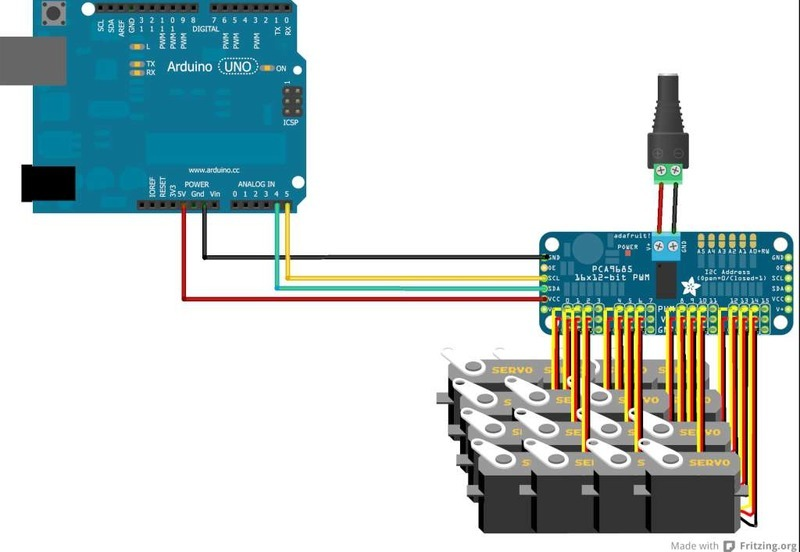

# PCA9685-Arduino

Biblioteca Arduino para uso com o módulo de 16 Canais PWM módelo PCA9685.

Este Módulo permite o controle de 16 motores por módulo em um canal I2C, é possível instalar mais de um módulo usando endereços I2C diferentes no mesmo barramento.

É fundamental que a Fonte usada seja capaz de alimentar todos os motores, o ideal é considerar 1A por motor para que não haja dúvida, na pior das hipóteses deve ser considerado 0,5A por motor.

Cada motor consume em média 800mA (0,8A) em carga máxima durante o movimento.

# VarSpeedServo

A Biblioteca VarSpeedServo é um Fork da Biblitoeca Servo e foi criada para permitir o uso de até 8 servos motores de forma assíncrona (porque ela usa interrupções) com controle de velocidade. Esta biblioteca não é compatível com o módulo PCA9685, portanto os motores devem ser ligados diretamente ao Arduino, mas lembre-se das limitações de alimentação que deve ser aparte.

A biblioteca permite definir a velocidade de movimento, opcionalmente aguardar até que o movimento termine e criar sequências de movimentos assíncronas de cada motor.

# Servo

Biblioteca padrão para controle de servo motores no Arduino.