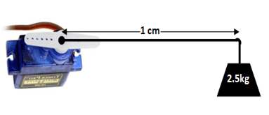
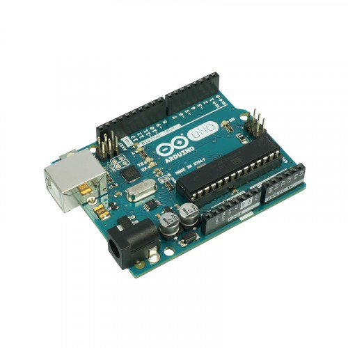

# Conceitos Básicos

Para ter sucesso no uso de qualquer Braço Robótico, mesmo que inferior em recursos quanto ao ARR-7, é preciso o domínio de alguns conceitos fundamentais, como o que é Tensão e Corrente, módulos básicos do Arduino e um pouco de programação.

<!--more-->

## O que é Kinematics

Quando se começa a brincar com robótica o que mais lemos e ouvimos falar é este tal de Kinematics, antes de tudo é importante entender que Kinematics e Cinematics são duas coisas distintas, apesar de lidar com movimento.

Cinematic é um adjetivo que qualifica as técnicas para produção de cinema tornando eficiente a visualização de cenas.

Jà a Kinematic é o ramo da mecânica referente ao movimento de objetos sem incluir as forças necessárias para promover tal movimento, sendo assim usamos a kinemática para identificar o posicionamento de objetos e movimentá-los podendo transformar tais posicionamentos e movimentos em fórmulas matemáticas e representação numérica para que se possa usar um computador ou microcontrolador para atuar sobre os mecanismos que auxiliam no posicionamento de tais peças.

A equipe que desenvolveu o Braço Robótico ARR-7 se utiliza dos estudos da Kinemática para desenvolver códigos (softwares, bibliotecas e frameworks) que facilitam o manuseio do braço e o desenvolvimento de novas soluções, permitindo assim que os estudantes sejam de que nível científico for (técnico ou acadêmico/superior) possam focar seus estudos e esforços nos algorítimos que irão trazer novas soluções a robótica e a engenharia de software.

## O que é Tensão e Corrente

Nesta oficina não iremos aprofundar no conceito de tensão e corrente, já que para sua compreensão é necessário também o entendimento do que é Resistência. Porém até o momento iremos nos conter como entendimento lúdico destes conceitos.

A Tensão é medida em Volts, não se usa o termo "Voltagem" pois é um erro de tradução deslegante para o conceito.

A Tensão pode ser comparado de forma didática a força que se exerce a uma corda, imagine uma corda de pular sendo esticada, por duas crianças que puxam de cada lado, A tensão está ali presente, de forma equilibrada quando as duas crianças aplicam a mesma força nas duas pontas. Porém se uma das crianças for mais forte que a outra, haverá o movimento para o lado da criança mais forte este movimento podemos chamar de corrente, e ele será tão intenso quanto a força que se aplica a um dos lados, chamaremos o lado mais forte de "positivo" o mais fraco de "negativo", com a presença de movimento temos então a corrente, que se for muito grande pode junto com a tensão muito alta, causar o rompimento da corda ou a queda de um dos jovens danificando o circuito (no caso os dois jovens e a corda).

Neste exemplo lúdico a tensão causará o movimento (corrente), que é medida em _Amper_ e erroneamente é chamada de _amperagem_ também por um erro de tradução do termo. A corrente, então, fluirá do lado mais fraco (negativo) para o lado mais forte (positivo), e haverá uma resistência a este movimento, quanto maior for a resistência menor é a corrente, quanto maior a tenção maior é a corrente. A Resistência é medida em _ohms_ e usa a letra grega Omega para representa-la.

Sendo assim, neste simples exemplo temos uma fórmula matemática que representa a relação entre estes conceitos, sendo **T** o valor da Tensão em volts (_v_), **I** o valor da corrente em Amperes (_A_) e **R** o valor da resistência em _ohms_ ( $ \Omega $ ):

$$
I = \frac{T}{R}
$$

Nestes projetos iremos sempre lidar com baixas tensões, que deverão ser sempre o valor de 5V, mas a corrente vária e veremos mais a frente mais detalhes. Em nosso projetos lidaremos com baixas correntes, mas se algo for montado errado poderá causar a queima da fonte por drenar muita corrente da mesma.

Observe o quanto isso é importante. A tensão deve sempre ser a especificada no caso 5V a fonte usada deve ser, portanto, capaz de atender esta tensão, mas pode fornecer corrente maior que a necessária, é sempre bom deixarmos uma margem de 10%, ou seja, se no total seu circuito drenar uma corrente de 800mA (oitocentos mile-amper), é bom que sua fonte seja capaz de fornecer 1A, escolhemos este valor porque é o mais próximo do comercialmente disponível.

Fique atento, como pode ver o valor da tensão é fixo o circuito sempre irá funcionar na tensão especificada, no caso dos nossos serão 5V na sua maioria. Mas a corrente, varia conforme o funcionamento do circuito, podendo ocorrer picos, e a fonte deve ser capaz de atender a estes picos.

## O que é Torque

Em se tratando de engrenagens, motores e ferramentas ouvimos muito o termo **Torque** que representa a força aplicada a um ponto conforme o comprimento de uma alavanca.

Quando falamos de torque em servo motores, são usadas medidas entre 1kg e 10kg, mais a frente veremos qual o Torque de cada motor que usamos, mas para um bom entendimento é importante perceber que o torque referido nos servo motores são em relação a 1cm do centro do eixo do servo motor. Assim quando na especificação do servomotor sugere que ele tem um torque de 2,5kg que dizer que do centro de seu eixo com uma pequena alavanca de 1cm ele será capaz de elevar este peso.

Não pense que a cada cm que esta alavanca for acrescida será multiplicado o peso que ele é capaz de elevar, mas isso não é prático, portanto cuidado, você não irá conseguir levantar 1 tonelada com um braço de 50cm, já que neste calculo incluem o peso do braço, o material no qual ele é fabricado e toda a estrutura de suporte do motor.

Mas tal informação é suficiente para compreendemos aproximadamente do que se trata o Torque, qual a capacidade do motor e mover algum outro objeto.

## Arduino e Módulos Básicos

Muitos passam a conhecer o arduino depois que começam a estudar a Robótica ou a Automação em geral, e não compreendem o que é exatamente o Arduino, chegando a pensar que é um microcontrolador. É fundamental que este mal entendio seja esclarecido já nos primeiros momentos de convívio com esta tecnologia que vai de um conceito a um equipamento físico.

O Arduino é a primeira vista uma placa de prototipação e uma interface de desenvolvimento, que permite ao seu usuário desenvolver de forma simplifica e rápida códigos para automação e robótica, não havendo um nicho especifico, mas sem dúvida com o objetivo principal de ser didática e barata.

O Arduino foi criado no Instituto Politécnico de Ivrea, com o objetivo de ser uma alternativa as caras placas de prototipação, estas placas eram oferecidas pelos fabricantes e normalmente eram compradas pela escola e por engenheiros que já desenvolviam seus projetos comercialmente, deixando o aluno numa lacuna já que seu poderia financeiro não lhe permitia comprar tais placas, que giravam na época em torno de U$ 500 (Quinhentos Dólares).

Com as pesquisas ligadas ao compo da arte e automação desenvolvidas no Instituo de Ivrea, foram amadurecendo soluções acessíveis aos seus alunos, até que chegaram ao Arduino, como já dito é uma placa e um software (IDE) de desenvolvimento, em suas primeiras versões sendo representada pelo Arduino UNO, ela é composta por uma placa padronizada que fornece a alimentação mínima necessária para o funcionamento de um microcontrolador e o circuito necessário para seu acoplamento ao microcomputador através da porta USB.

O Software que permite o desenvolvimento para Arduino foi desenvolvido usando a linguagem Java, porém o microcontrolador é programado usando a linguagem C/C++ que quando compilada gera códigos na linguagem Assembly que é finalmente armazenada na memória do microcontrolador. A IDE do Arduino agrega o compilador GCC que é um software aberto e livre (gratuito) que converte o texto escrito na linguagem C/C++ para o Assembly utilizado pelo microcontrolador do Arduino. A IDE do Arduino também adota um formato de programação bastante típico para o contexto já utilizado no Instituto de Ivrea, e foi herdado de outra ferramenta chamada Processing, mas antes deste amadurecimento final, foi adotado o Wire que vamos dizer que foi o progenitor do Arduino.

Na programação para o Arduino usando o Wire é composto pelo código principal e por bibliotecas que são facilmente adicionados ao ambiente, não iremos entrar neste detalhes por hora. O Código principal é dividido em 3 parte principais:

- Primeiramente são carregadas as bibliotecas que serão utilizadas em seu projeto
- A Seguir é definida uma função chamada `setup()` que não recebe parâmetro algum e tem como responsabilidade preparar o microcontrolador e recursos relacionados para uso no projeto.
- E finalmente a função chamada `loop()` que é continuamente executada e deve conter o código que irá fazer com que seu projeto tome vida.

Como dito acima o Arduino é também uma placa, como podem ver o Arduino pode ser definido com um _Conceito_ que delimita desde a metologia do desenvolvimento de seu projeto, oferece ferramentas de desenvolvimento, hardware mínimo para desenvolvimento físico e acessórios.

O Arduino quanto a sua apresentação física é uma placa um pouco maior que um cartão de crédito que possui um microcontrolador, um adaptador USB e um regulador de tensão mínimo para adequar as tensões quando alimentado externamente (sem ser pela porta USB do microcomputador).

O Arduino através de sua disposição de pinos oferece um formato de conexão que permitiu a criação de placas acessórias que são chamadas de *Shields* tais placas são expansões para o microcontrolador podendo também ser chamadas de módulos de expansão, cada Shield costuma ser de uso bastante específico, e devido ao formato oferecido pelo Arduino, podem ser encaixados um sobre o outro, já que a pinagem é transporta de forma a dar acesso a placa superior aos mesmo pinos disponibilizados pelo Arduino.

Muitas vezes os Shields anulam os pinos que não poderão ser reaproveitados evitando assim conflitos.

Outros Shields como um que usaremos para dar acesso a portas digitais em um formato adequado para os motores usados no braço robótico não permite o encaixe de novos shields já que reformatam as conexões para uso final.

Em nosso projetos usaremos apenas dois tipos de Shields e módulos na fase inicial, o Shield para Servo Motores, e o Shield/Modulo que possibilita a concentração (multiplexação) de mais de uma dezena de motores em um barramento chamado I2C. Veremos detalhes quando for a hora.

### O que é Microcontrolador

Como vimos acima o Arduino não é um microcontrolador, mas possui um, e o que é então um microcontrolador?

Bem, o Arduino utiliza em sua versão mais conhecida, Arduino UNO, o microcontrolador ATMega328 que foi criado e fabricado originalmente pela ATMel, comprada pela Microchip e hoje faz parte da vasta lista de microcontroladores desta empresa.

O Microcontrolador poderia ser facilmente confundido com um pequeno microcomputador em um único chip, porém não teria monitor e também não teria teclado nem mouse, já que o microcontrolador possui tudo que caracteriza um computador, em um único chip possui uma CPU (Central Process Unit), memória, unidades de entrada e saída.

Porém o Microcontrolador diferente de um computador é construído com funções especificas e na verdade um processador simplificado para uso especifico empoderado com recursos para sua natureza, alguns são mais genéricos outros menos. Há milhares de modelos de Microcontroladores, alguns com muita memória e pinos para comunicação com o mundo exterior, outros com muitos recursos de apoio como conversores análogico para digital, alguns tem mais que um conversores, outros com conversores digital para análogico que permite gerar sons, há os que possuem diversos tipos de barramento para conexão diversificada de módulos e uso em nichos específicos como automobilismo, náutica (espacial e marítima).

Tanto como no computador como nos microcontroladores oque define seu poder computacional está atrelado a 3 fatores principais, sua capacidade matemática/computacional, sua memória e velocidade.

Os Microcontroladores possuem arquiteturas que lhe permitem ser mais econômicos na energia ou então terem um maior poder computacional matemático, muitas vezes tal arquitetura não impedem os mesmos de fazerem as mesmas tarefas, mas demandão ou mais energia ou mais tempo, tornando seu uso inviável.

>> Por hora é importante sabermos que o Arduino UNO utiliza um microcontrolador de 8bits que nos tempos atuais pode parecer pouco, mas não hé diante de sua aplicação, lembrando que foi um microcontrolador de tecnologia inferior que levou o homem a lua e o colocou em orbita várias vezes. 
>> Portanto o Arduino é um grande instrumento em suas mãos, e seu domínio pode lhe render grandes projetos.

## Servo Motores

Na robótica o que mais é utilizado são motores, porém tais motores tem características bastante especiais.

A Primeira característica é que são motores de precisão, eles permitem que facilmente controle seu giro no sentido horário ou anti-horário. 

Alguns são motores comuns sem escova, que através do sentido da corrente em suas bobinas eles giram no sentido desejado e conforme a intensidade desta corrente controla-se sua velocidade.

Outros são motores que também usam bobinas, mas estas são dispostas em uma forma alternada para que conforme a sequência de pulsos promovam o movimento do motor na direção desejada, e a velocidade dos pulsos determina também a velocidade no qual o motor gira.

Porem não é possível identificar exatamente em qual posição o motor se encontra, para isso foram criados os **Servo Motores**, são na verdade um conjunto que engloba:

* Motor
* Engrenagem
* Sensores
* microcontrolador
* Circuito alimentado

Os Servo Motores, possuem no seu conjunto um microcontrolador que é especialmente programado para controlar o circuito de alimentação e consequentemente o motor, observando seu giro através de sensores.

Os Servo Motores mais simples como os que usaremos usam um potenciômetro para identificar a posição do motor, portanto como potenciômetros comuns não fazem um giro completo, na sua maioria não é possível ter um servo motor que gire mais que 300 graus, boa parte deles é limitado a 180 graus. O monitoramento do potenciômetro como sensor de posição e o devido acionamento do motor de forma temporizada forma o que chamamos de **Loop Fechado*.

As engrenagens que compõem o servo motor permitem que se tenha um Torque ideal para seu tamanho, convertendo assim velocidade de giro do motor em força para que suporte a mecânica do Robot, em nosso caso o braço. a Engrenagem também permite que se tenha maior precisão do posicionamento do giro do Servo Motor, já que o motor precisa dar diversas voltas em seu eixo para que o eixo final do **servo motor** atinja a posição desejada.

Os servomotores são facilmente conectados ao Arduino, para tal é preciso apenas 3 fios, sendo dois para alimentação e um para controle.

É importante saber que nenhuma das portas do Arduino é capaz de alimentar um Servo motor, portanto é preciso que se tenha uma fonte externa de alimentação especifica para o motor. Conforme o tamanho e torque do Servo Motor este irá drenar uma certa corrente mesmo que todos sejam alimentados na mesma tensão de 5V. Mais a diante iremos ver detalhes de cada servo motor.

A placa do Arduino deverá ser responsável apenas por controlar o servo motor, portanto apenas o pino de controle deve ser ligado a uma das portas digitais do mesmo.

## A programação

Não será possível entrar em detalhes sobre o que se precisa aprender de programação aqui, pois não é nosso objetivo  apresentar os conceitos mínimos necessário, espera-se que o usuário já tenha conhecimento básico de programação com o Arduino, por exemplo seja capaz de instalar uma nova biblioteca, comunicar via serial, usar a função `setup()` e `loop()`, criar novas funções simples, usar as funções das bibliotecas instaladas.

Não usaremos nenhum recurso avançado do Arduino, todos os recursos são básicos e no caso das bibliotecas e funções intermediário.

Também não usaremos interrupções, mas será preciso compreender bem a estrutura de um código orientado ao tempo ou fatiamento deste, já que não há como produzir códigos, neste nível de conhecimento, que permita a execução em paralelo ou que simule ta execução.

Usaremos em nossos códigos de forma exaustiva estruturas de controle do tipo `if/else` e `switch`, podendo também usarmos estruturas de loop `for` e `while`, porém a biblioteca **VarSpeedServo** já reduz bastante o código que anteriormente precisava para simular diferentes velocidades.

Vejamos agora um pouco sobre [Mecatrônica, clique aqui.](./mecatronica.md)