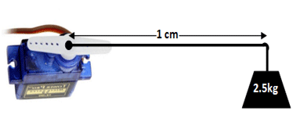

# Conceitos básicos de Mecatrônica

## O que é Kinematics

Quando se começa a brincar com robótica o que mais lemos e ouvimos falar é este tal de Kinematics, antes de tudo é importante entender que Kinematics e Cinematics são duas coisas distintas, apesar de lidar com movimento.

Cinematic é um adjetivo que qualifica as técnicas para produção de cinema tornando eficiente a visualização de cenas.

Jà a Kinematic é o ramo da mecânica referente ao movimento de objetos sem incluir as forças necessárias para promover tal movimento, sendo assim usamos a kinemática para identificar o posicionamento de objetos e movimentá-los podendo transformar tais posicionamentos e movimentos em fórmulas matemáticas e representação numérica para que se possa usar um computador ou microcontrolador para atuar sobre os mecanismos que auxiliam no posicionamento de tais peças.

A equipe que desenvolveu o Braço Robótico ARR-7 se utiliza dos estudos da Kinemática para desenvolver códigos (softwares, bibliotecas e frameworks) que facilitam o manuseio do braço e o desenvolvimento de novas soluções, permitindo assim que os estudantes sejam de que nível científico for (técnico ou acadêmico/superior) possam focar seus estudos e esforços nos algorítimos que irão trazer novas soluções a robótica e a engenharia de software.

## O que é Torque

Em se tratando de engrenagens, motores e ferramentas ouvimos muito o termo **Torque** que representa a força aplicada a um ponto conforme o comprimento de uma alavanca.

Quando falamos de torque em servo motores, são usadas medidas entre 1kg e 10kg, mais a frente veremos qual o Torque de cada motor que usamos, mas para um bom entendimento é importante perceber que o torque referido nos servo motores são em relação a 1cm do centro do eixo do servo motor. Assim quando na especificação do servomotor sugere que ele tem um torque de 2,5kg que dizer que do centro de seu eixo com uma pequena alavanca de 1cm ele será capaz de elevar este peso.

Perceba que quanto maior o breaço, ou seja mais distânte do centro do eixo do motor, menor será o peso capaz de ser levantado.

Mas tal informação é suficiente para compreendemos aproximadamente do que se trata o Torque, qual a capacidade do motor e mover algum outro objeto.

## O que é Graus de Liberdade (DoF)

## Conceitos Básicos de Trignometria

## Tipos de Motores

### Servo Motores

Na robótica o que mais é utilizado são motores, porém tais motores tem características bastante especiais.

A Primeira característica é que são motores de precisão, eles permitem que facilmente controle seu giro no sentido horário ou anti-horário. 

Alguns são motores comuns sem escova, que através do sentido da corrente em suas bobinas eles giram no sentido desejado e conforme a intensidade desta corrente controla-se sua velocidade.

Outros são motores que também usam bobinas, mas estas são dispostas em uma forma alternada para que conforme a sequência de pulsos promovam o movimento do motor na direção desejada, e a velocidade dos pulsos determina também a velocidade no qual o motor gira.

Porem não é possível identificar exatamente em qual posição o motor se encontra, para isso foram criados os **Servo Motores**, são na verdade um conjunto que engloba:

* Motor
* Engrenagem
* Sensores
* microcontrolador
* Circuito alimentado

Os Servo Motores, possuem no seu conjunto um microcontrolador que é especialmente programado para controlar o circuito de alimentação e consequentemente o motor, observando seu giro através de sensores.

Os Servo Motores mais simples como os que usaremos usam um potenciômetro para identificar a posição do motor, portanto como potenciômetros comuns não fazem um giro completo, na sua maioria não é possível ter um servo motor que gire mais que 300 graus, boa parte deles é limitado a 180 graus. O monitoramento do potenciômetro como sensor de posição e o devido acionamento do motor de forma temporizada forma o que chamamos de **Loop Fechado*.

As engrenagens que compõem o servo motor permitem que se tenha um Torque ideal para seu tamanho, convertendo assim velocidade de giro do motor em força para que suporte a mecânica do Robot, em nosso caso o braço. a Engrenagem também permite que se tenha maior precisão do posicionamento do giro do Servo Motor, já que o motor precisa dar diversas voltas em seu eixo para que o eixo final do **servo motor** atinja a posição desejada.

Os servomotores são facilmente conectados ao Arduino, para tal é preciso apenas 3 fios, sendo dois para alimentação e um para controle.

É importante saber que nenhuma das portas do Arduino é capaz de alimentar um Servo motor, portanto é preciso que se tenha uma fonte externa de alimentação especifica para o motor. Conforme o tamanho e torque do Servo Motor este irá drenar uma certa corrente mesmo que todos sejam alimentados na mesma tensão de 5V. Mais a diante iremos ver detalhes de cada servo motor.

A placa do Arduino deverá ser responsável apenas por controlar o servo motor, portanto apenas o pino de controle deve ser ligado a uma das portas digitais do mesmo.

